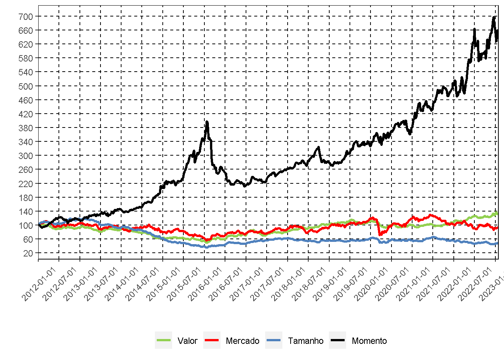

::: {.cell}

:::

::: {.cell}

:::

::: {.cell}

:::


## Estratégias de Investimento (Long - Short) (02/01/2012 - 27/01/2023)

Em 02/jan/2012 foram (teoricamente) investidos R\$ 100 em 4 carteiras long-short tradicionais da literatura de Economia Financeira. O gráfico apresenta a evolução dos valores das carteiras. (1) Carteira de Mercado: comprada em ações e vendida na taxa de juros livre de risco; (2) Carteira Tamanho: comprada em ações de empresas pequenas e vendida em ações em empresas grandes; (3) Carteira Valor: comprada em ações de empresas com alta razão "valor contábil-valor de mercado" e vendida em ações de empresas com baixa razão; (4) Carteira Momento: comprada em ações de empresas vencedoras e vendida em ações de empresas perdedoras. Para detalhes, visite o site do NEFIN, seção "Fatores de Risco": <http://nefin.com.br/risk_factors.html>


::: {.cell}
::: {.cell-output-display}
{width=672}
:::

::: {.cell-output-display}
`````{=html}
<table class="table" style="margin-left: auto; margin-right: auto;">
 <thead>
  <tr>
   <th style="text-align:left;">   </th>
   <th style="text-align:right;"> Mercado </th>
   <th style="text-align:right;"> Tamanho </th>
   <th style="text-align:right;"> Valor </th>
   <th style="text-align:right;"> Momento </th>
  </tr>
 </thead>
<tbody>
  <tr>
   <td style="text-align:left;font-weight: bold;"> Semana </td>
   <td style="text-align:right;"> 0.39% </td>
   <td style="text-align:right;"> 2.33% </td>
   <td style="text-align:right;"> -0.09% </td>
   <td style="text-align:right;"> -2.91% </td>
  </tr>
  <tr>
   <td style="text-align:left;font-weight: bold;"> Mês atual </td>
   <td style="text-align:right;"> 1.46% </td>
   <td style="text-align:right;"> 5.79% </td>
   <td style="text-align:right;"> 1.12% </td>
   <td style="text-align:right;"> -3.34% </td>
  </tr>
  <tr>
   <td style="text-align:left;font-weight: bold;"> 2023 </td>
   <td style="text-align:right;"> -10.15% </td>
   <td style="text-align:right;"> -19.27% </td>
   <td style="text-align:right;"> 19.69% </td>
   <td style="text-align:right;"> 31.88% </td>
  </tr>
  <tr>
   <td style="text-align:left;font-weight: bold;"> 2010 - 2023 </td>
   <td style="text-align:right;"> -25.27% </td>
   <td style="text-align:right;"> -52.08% </td>
   <td style="text-align:right;"> 16.70% </td>
   <td style="text-align:right;"> 988.88% </td>
  </tr>
</tbody>
</table>

`````
:::
:::


## Dividend Yield da Bolsa (01/01/2009 - 27/01/2023)

O gráfico acima apresenta a evolução histórica do ***dividend yield*** do mercado acionário brasileiro: razão entre o total pago de dividendos nos últimos 12 meses pelas empresas e o valor total das empresas hoje. Essa é tradicionalmente uma variável estacionária (reverte à média) e é positivamente correlacionada com o retorno futuro esperado dos investidores. Ou seja, é alta em momentos ruins (de alto risco ou alta aversão ao risco), quando os investidores exigem retorno esperado alto para investir no mercado, e baixa em momentos bons. A tabela apresenta o inverso do ***dividend yield***, conhecido como Razão Preço-Dividendo, de algumas empresas. Ordenam-se os papéis da última semana de acordo com essa medida e reportam-se os papéis com as dez maiores e dez menores Razões Preço-Dividendo.


::: {.cell layout="[[1], [2,2]]"}
::: {.cell-output-display}
{width=672}
:::

::: {.cell-output-display}
`````{=html}
<table class="table" style="margin-left: auto; margin-right: auto;">
 <thead>
<tr><th style="border-bottom:hidden;padding-bottom:0; padding-left:3px;padding-right:3px;text-align: center; " colspan="2"><div style="border-bottom: 1px solid #ddd; padding-bottom: 5px; ">10 Maiores</div></th></tr>
  <tr>
   <th style="text-align:left;"> Papel </th>
   <th style="text-align:right;"> Preço-Dividendo </th>
  </tr>
 </thead>
<tbody>
  <tr>
   <td style="text-align:left;"> RAIL3 </td>
   <td style="text-align:right;"> 968.6468 </td>
  </tr>
  <tr>
   <td style="text-align:left;"> ECOR3 </td>
   <td style="text-align:right;"> 601.2623 </td>
  </tr>
  <tr>
   <td style="text-align:left;"> PETZ3 </td>
   <td style="text-align:right;"> 395.7475 </td>
  </tr>
  <tr>
   <td style="text-align:left;"> DASA3 </td>
   <td style="text-align:right;"> 208.3669 </td>
  </tr>
  <tr>
   <td style="text-align:left;"> CRFB3 </td>
   <td style="text-align:right;"> 175.1928 </td>
  </tr>
  <tr>
   <td style="text-align:left;"> SLCE3 </td>
   <td style="text-align:right;"> 143.1981 </td>
  </tr>
  <tr>
   <td style="text-align:left;"> CCRO3 </td>
   <td style="text-align:right;"> 135.3118 </td>
  </tr>
  <tr>
   <td style="text-align:left;"> TOTS3 </td>
   <td style="text-align:right;"> 128.8011 </td>
  </tr>
  <tr>
   <td style="text-align:left;"> AESB3 </td>
   <td style="text-align:right;"> 114.8074 </td>
  </tr>
  <tr>
   <td style="text-align:left;"> ALSO3 </td>
   <td style="text-align:right;"> 103.3352 </td>
  </tr>
</tbody>
</table>

`````
:::

::: {.cell-output-display}
`````{=html}
<table class="table" style="margin-left: auto; margin-right: auto;">
 <thead>
<tr><th style="border-bottom:hidden;padding-bottom:0; padding-left:3px;padding-right:3px;text-align: center; " colspan="2"><div style="border-bottom: 1px solid #ddd; padding-bottom: 5px; ">10 Menores</div></th></tr>
  <tr>
   <th style="text-align:left;"> Papel </th>
   <th style="text-align:right;"> Preço-Dividendo </th>
  </tr>
 </thead>
<tbody>
  <tr>
   <td style="text-align:left;"> AMER3 </td>
   <td style="text-align:right;"> 1.523588 </td>
  </tr>
  <tr>
   <td style="text-align:left;"> PETR4 </td>
   <td style="text-align:right;"> 1.578460 </td>
  </tr>
  <tr>
   <td style="text-align:left;"> MOVI3 </td>
   <td style="text-align:right;"> 5.143208 </td>
  </tr>
  <tr>
   <td style="text-align:left;"> MRFG3 </td>
   <td style="text-align:right;"> 5.572084 </td>
  </tr>
  <tr>
   <td style="text-align:left;"> AGRO3 </td>
   <td style="text-align:right;"> 5.618155 </td>
  </tr>
  <tr>
   <td style="text-align:left;"> UNIP6 </td>
   <td style="text-align:right;"> 7.509790 </td>
  </tr>
  <tr>
   <td style="text-align:left;"> SYNE3 </td>
   <td style="text-align:right;"> 7.936540 </td>
  </tr>
  <tr>
   <td style="text-align:left;"> GGBR4 </td>
   <td style="text-align:right;"> 8.843585 </td>
  </tr>
  <tr>
   <td style="text-align:left;"> ENAT3 </td>
   <td style="text-align:right;"> 8.907994 </td>
  </tr>
  <tr>
   <td style="text-align:left;"> ENBR3 </td>
   <td style="text-align:right;"> 9.092863 </td>
  </tr>
</tbody>
</table>

`````
:::
:::


## Mercado de Aluguel de Ações (01/01/2023 - 26/01/2023)

O gráfico apresenta a evolução histórica do ***short interest*** do mercado acionário brasileiro e a taxa média de aluguel de ações. O ***short interest*** de uma empresa é dado pela razão entre a quantidade de ações em aluguel e a quantidade de ações ***outstanding***. Mede assim o estoque de vendas à descoberto realizadas com as ações da empresa, tendendo a ser maior em momentos de expectativa de queda no valor da empresa. O ***short interest*** do mercado, apresentado no gráfico, é a média (ponderada por valor) dos ***short interest*** individuais. A tabela reporta os 5 maiores short interest individuais e taxas de aluguel da semana passada, tanto em nível como primeira diferença (no caso deste último, são excluídos os papéis que tiveram variação negativa).


::: {.cell layout="[[1], [2,2]]"}
::: {.cell-output-display}
{width=672}
:::

::: {.cell-output-display}
`````{=html}
<table class="table" style="margin-left: auto; margin-right: auto;">
 <thead>
<tr><th style="border-bottom:hidden;padding-bottom:0; padding-left:3px;padding-right:3px;text-align: center; " colspan="4"><div style="border-bottom: 1px solid #ddd; padding-bottom: 5px; ">5 Maiores da Semana</div></th></tr>
<tr>
<th style="border-bottom:hidden;padding-bottom:0; padding-left:3px;padding-right:3px;text-align: center; " colspan="2"><div style="border-bottom: 1px solid #ddd; padding-bottom: 5px; ">Short <br> Interest</div></th>
<th style="border-bottom:hidden;padding-bottom:0; padding-left:3px;padding-right:3px;text-align: center; " colspan="2"><div style="border-bottom: 1px solid #ddd; padding-bottom: 5px; ">Taxa <br> de Aluguel</div></th>
</tr>
  <tr>
   <th style="text-align:left;">  </th>
   <th style="text-align:right;">  </th>
   <th style="text-align:left;">  </th>
   <th style="text-align:right;">  </th>
  </tr>
 </thead>
<tbody>
  <tr>
   <td style="text-align:left;"> IRBR3 </td>
   <td style="text-align:right;"> 96.43% </td>
   <td style="text-align:left;"> GFSA3 </td>
   <td style="text-align:right;"> 124.18% </td>
  </tr>
  <tr>
   <td style="text-align:left;"> OIBR3 </td>
   <td style="text-align:right;"> 16.73% </td>
   <td style="text-align:left;"> PRNR3 </td>
   <td style="text-align:right;"> 118.88% </td>
  </tr>
  <tr>
   <td style="text-align:left;"> CVCB3 </td>
   <td style="text-align:right;"> 14.31% </td>
   <td style="text-align:left;"> SAPR4 </td>
   <td style="text-align:right;"> 110.69% </td>
  </tr>
  <tr>
   <td style="text-align:left;"> VIIA3 </td>
   <td style="text-align:right;"> 12.29% </td>
   <td style="text-align:left;"> VIVR3 </td>
   <td style="text-align:right;"> 76.49% </td>
  </tr>
  <tr>
   <td style="text-align:left;"> USIM5 </td>
   <td style="text-align:right;"> 12.06% </td>
   <td style="text-align:left;"> KLBN3 </td>
   <td style="text-align:right;"> 65.22% </td>
  </tr>
</tbody>
</table>

`````
:::

::: {.cell-output-display}
`````{=html}
<table class="table" style="margin-left: auto; margin-right: auto;">
 <thead>
<tr><th style="border-bottom:hidden;padding-bottom:0; padding-left:3px;padding-right:3px;text-align: center; " colspan="4"><div style="border-bottom: 1px solid #ddd; padding-bottom: 5px; ">5 Maiores da Semana</div></th></tr>
<tr>
<th style="border-bottom:hidden;padding-bottom:0; padding-left:3px;padding-right:3px;text-align: center; " colspan="2"><div style="border-bottom: 1px solid #ddd; padding-bottom: 5px; ">Variação no Short Interest</div></th>
<th style="border-bottom:hidden;padding-bottom:0; padding-left:3px;padding-right:3px;text-align: center; " colspan="2"><div style="border-bottom: 1px solid #ddd; padding-bottom: 5px; ">Variação na Taxa de Aluguel</div></th>
</tr>
  <tr>
   <th style="text-align:left;">  </th>
   <th style="text-align:right;">  </th>
   <th style="text-align:left;">  </th>
   <th style="text-align:right;">  </th>
  </tr>
 </thead>
<tbody>
  <tr>
   <td style="text-align:left;"> IRBR3 </td>
   <td style="text-align:right;"> 85.81% </td>
   <td style="text-align:left;"> SAPR4 </td>
   <td style="text-align:right;"> 31.82% </td>
  </tr>
  <tr>
   <td style="text-align:left;"> BRKM5 </td>
   <td style="text-align:right;"> 1.35% </td>
   <td style="text-align:left;"> VIVR3 </td>
   <td style="text-align:right;"> 21.25% </td>
  </tr>
  <tr>
   <td style="text-align:left;"> MBLY3 </td>
   <td style="text-align:right;"> 1.00% </td>
   <td style="text-align:left;"> PRNR3 </td>
   <td style="text-align:right;"> 15.02% </td>
  </tr>
  <tr>
   <td style="text-align:left;"> CVCB3 </td>
   <td style="text-align:right;"> 0.84% </td>
   <td style="text-align:left;"> TAEE3 </td>
   <td style="text-align:right;"> 8.84% </td>
  </tr>
  <tr>
   <td style="text-align:left;"> BRAP4 </td>
   <td style="text-align:right;"> 0.68% </td>
   <td style="text-align:left;"> CEAB3 </td>
   <td style="text-align:right;"> 7.16% </td>
  </tr>
</tbody>
</table>

`````
:::
:::

